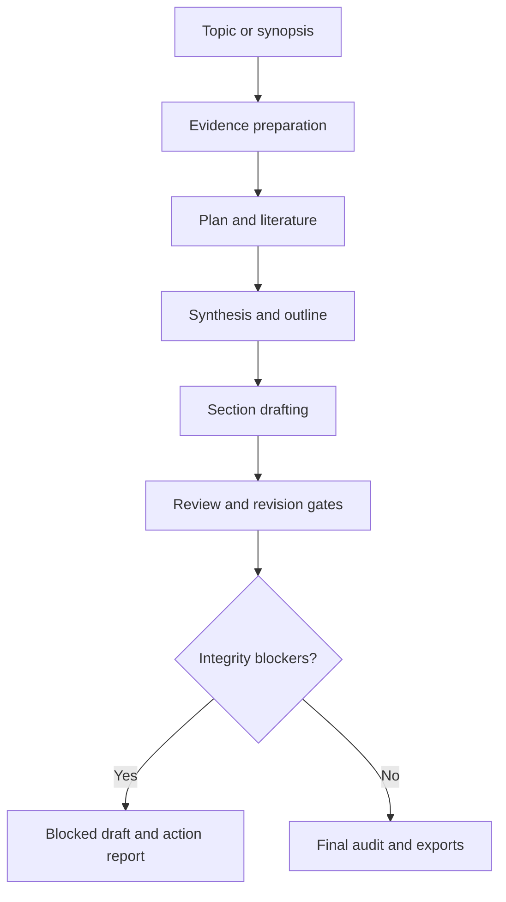
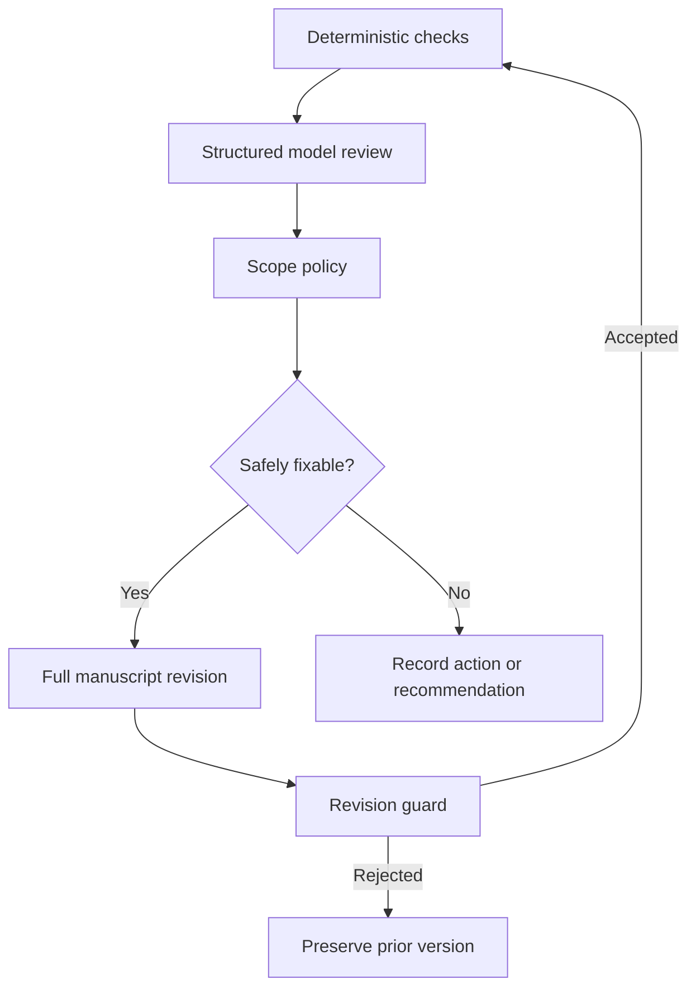

# PaperForge 1.0 Architecture

## Product boundary

PaperForge is an evidence-constrained authoring system. Language models plan, synthesize, draft,
review, and revise. Deterministic code owns workflow transitions, evidence provenance, reference
identity, severity policy, revision guards, readiness, and persistence.

No language-model response can:

- create another user-input round;
- add a reference to the verified catalogue;
- mark its own output submission-ready;
- redefine an optional activity as a blocker;
- overwrite a user-controlled input file;
- bypass a failed citation or numeric-claim guard.

## State machine

The ordered stages are:

1. `prepare`
2. `plan`
3. `literature`
4. `synthesis`
5. `outline`
6. `draft`
7. `evidence_review`
8. `methodology_review`
9. `results_review`
10. `writing_review`
11. `journal_review`
12. `final_review`
13. `export`

`WorkflowEngine` is the only transition owner. `StageRunner` implements stage behavior but cannot
skip, reorder, or persist stage status independently.

## Component responsibilities

| Component | Owns | Must not own |
| --- | --- | --- |
| `ProjectStore` | Atomic writes, locks, migration, versions, fingerprints | Scientific judgment |
| `DocumentIngestor` | Extraction, checksums, locators, evidence IDs | External scholarly claims |
| `StatisticsDeriver` | Explicit deterministic calculations | Guessing missing input values |
| `LiteratureService` | OpenAlex search, deduplication, Crossref verification | Manuscript claims |
| `LLMClient` | JSON validation, repair bounds, text boundaries | Workflow transitions |
| `StageRunner` | Planning, synthesis, drafting, review/revise contracts | Readiness declaration |
| `IssuePolicy` | Scope-aware issue disposition | Hiding integrity defects |
| Validators | Citation, numeric, structure, placeholder, revision guards | Creative rewriting |
| `OutputExporter` | Citation rendering and deliverables | Changing scientific content |

## Evidence model

User-controlled files are the authoritative source for study-specific facts. Each extracted item has:

- a stable `EV-*` identifier derived from its relative path;
- an evidence kind;
- source path and locator;
- SHA-256 checksum;
- extraction metadata;
- bounded content.

`inputs/responses.yaml` is read as user evidence when it contains non-empty answers. It is never
rewritten by the workflow.

Computed evidence is allowed only through named deterministic calculators with explicit source
evidence IDs and formula versions. The confusion-matrix calculator requires all four counts.

## Literature and citation trust

OpenAlex records are accepted only when essential metadata exists and the record is not retracted.
DOI records can be cross-checked through Crossref. The search manifest records queries, counts,
provider, timestamp, and warnings.

Models see canonical citation IDs (`REF001`, `REF002`, and so on) and must cite them as
`[@REF001]`. They cannot create catalogue entries. Export assigns numbers by first appearance and
builds the bibliography deterministically.

## Review and revision loop

Each review stage performs:

The model self-score is stored but does not control readiness. `quality_score` is calculated from
normalized issues.

### Integrity blockers

- fabricated or unknown citation;
- unsupported study-specific numeric claim;
- unsupported or contradictory result;
- unresolved placeholder;
- missing or empty required section;
- truncated revision;
- factual contradiction.

### Scope-aware author actions

Calibration, uncertainty, reproducibility, data availability, and similar missing details are
handled through truthful disclosure when the evidence cannot support more. They remain author
actions only when the manuscript still lacks an adequate boundary.

### Non-blocking recommendations

External baselines, simulation, and regulatory analysis remain recommendations unless the research
scope or journal configuration explicitly requires them.

## Revision guard

Before any model revision replaces `manuscript/current.md`, PaperForge checks:

- the document was not truncated;
- every citation marker exists in the catalogue;
- a newly introduced number exists in prior text, user/computed evidence, or a cited source context;
- no internal placeholder remains.

A rejected candidate is not versioned as current.

## Resumption and invalidation

State is stored in `audit/state.json` under schema 3. Completed stages are skipped on rerun.

The input fingerprint covers:

- user-controlled profile fields;
- `inputs/`, `sources/`, `data/`, and `figures/` content;
- configuration fingerprint.

Generated fields such as resolved paper type are excluded. A user/config change preserves the prior
manuscript version and invalidates generated stages. Outputs never affect the fingerprint.

## Migration

Loading a v0.2 project creates:

- `audit/state.v2.json`;
- `paperforge.v2.yaml`;
- `manuscript/versions/legacy-v0.2.1.md` when a manuscript exists.

The application then starts the schema-3 pipeline. It does not translate the old question ledger
into new workflow control; existing saved answers are ingested as evidence.

## Failure semantics

- Provider, schema, filesystem, and literature errors are explicit and resumable.
- HTTP 401/403/404 failures are non-retryable.
- HTTP 429 and transient server/network failures use bounded retries.
- A stage exception records `failed` and keeps earlier artifacts.
- An integrity blocker records `blocked` and exports the current draft and report when available.
- Only `passed` and `passed_with_actions` stages advance.

## Trust and privacy boundaries

- Project evidence is sent to the configured model provider.
- Literature search queries and bibliographic identifiers are sent to OpenAlex/Crossref.
- Source text is treated as untrusted content; prompt instructions embedded inside it are ignored.
- API keys are read from environment variables and are never written into project artifacts.
