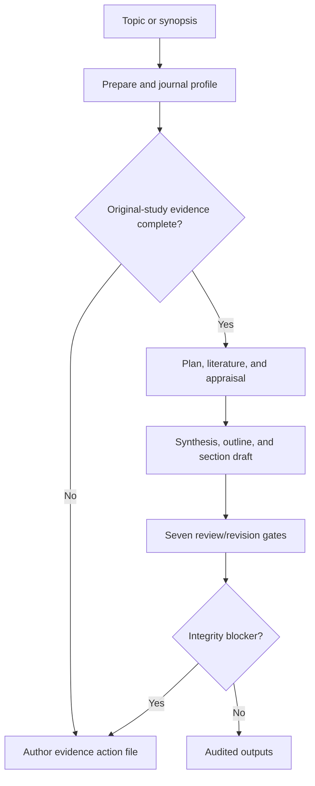
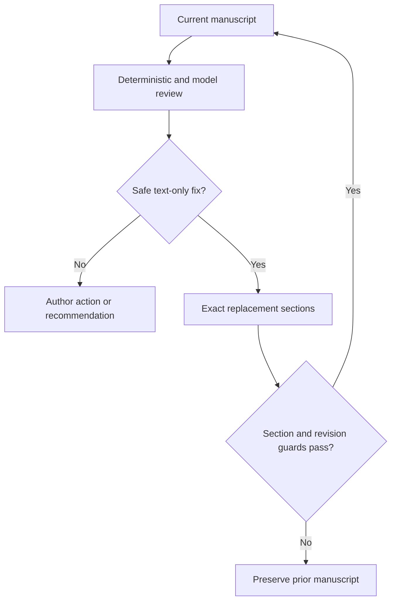

# PaperForge 2.0 Architecture

## Product boundary

PaperForge is an evidence-constrained authoring system. Language models plan, synthesize, draft,
review, and propose targeted revisions. Deterministic code owns workflow transitions, evidence and
claim provenance, reference identity, publication contracts, issue disposition, revision guards,
readiness, migration, and persistence.

No model response can:

- add a source to the verified catalogue;
- redefine an optional activity as an integrity blocker;
- mark its own output submission-ready;
- overwrite a user-controlled input file;
- introduce or reorder a major manuscript section;
- replace an unaffected section during revision;
- bypass citation, numeric-provenance, declaration, structure, or truncation guards.

## State machine

The ordered stages are:

1. `prepare`
2. `journal_profile`
3. `evidence_mapping`
4. `plan`
5. `literature`
6. `source_appraisal`
7. `synthesis`
8. `outline`
9. `draft`
10. `evidence_review`
11. `methodology_review`
12. `results_review`
13. `discussion_review`
14. `writing_review`
15. `journal_review`
16. `final_review`
17. `export`

`WorkflowEngine` is the sole transition owner. `StageRunner` implements a stage but cannot skip,
reorder, or persist its own pass/fail state.

## Component responsibilities

| Component | Owns | Must not own |
| --- | --- | --- |
| `ProjectStore` | Atomic writes, locks, migration, versions, fingerprints | Scientific judgment |
| `DocumentIngestor` | Extraction, checksums, locators, evidence IDs | External claims |
| `StatisticsDeriver` | Named deterministic calculations | Guessing missing values |
| Evidence mapper | Claim atoms, requirement coverage, pre-draft gate | Rewriting author evidence |
| Standards registry | Checked journal profiles and indexing context | Claiming acceptance |
| `LiteratureService` | Search, deduplication, DOI verification, ranking | Manuscript findings |
| `LLMClient` | Structured-output validation and bounded repair | Workflow transitions |
| `StageRunner` | Planning, synthesis, section drafting, review contracts | Readiness declaration |
| `IssuePolicy` | Scope-aware disposition | Hiding integrity defects |
| Validators | Structure, citations, numbers, declarations, depth, revision guards | Creative rewriting |
| `OutputExporter` | Citation rendering and auditable deliverables | Scientific-content changes |

## Evidence model

User-controlled project files are authoritative for study-specific facts. Each extracted record has
a stable `EV-*` ID, kind, source path, locator, checksum, and bounded content. Original-study records
are split into exact `CLM-*` atoms; the claim ledger retains the source evidence and numeric atoms.

The pre-draft coverage gate distinguishes:

- `draft_blocking`: a defensible original paper cannot be written yet;
- `submission_blocking`: drafting can proceed only with a transparent unresolved author action;
- `recommended`: useful strengthening work that is not falsely treated as mandatory.

`inputs/responses.yaml` and its compatibility aliases are read-only author evidence. The workflow
writes questions only to `author-actions/evidence-required.md`.

Computed evidence is allowed only through named deterministic calculators with explicit inputs and a
formula version. Confusion-matrix calculations require all four raw counts.

## Publication contract

`journal_profile` resolves a `PublicationProfile` before planning. It specifies checked status,
article type, main-text and abstract ranges, keyword/reference counts, section order and depth,
declarations, display-item limits, formatting rules, review dimensions, and source URLs.

The built-in DJES profile is marked checked. A generic profile is deliberately unverified and creates
an author action during journal/final review, preventing a false submission-ready result. Scopus and
Web of Science/SCIE criteria are retained only as indexing context because they evaluate journals,
not individual manuscripts.

## Literature and citation trust

OpenAlex records are accepted only when essential metadata exists and retracted records are removed.
DOIs can be cross-checked with Crossref. The search manifest records the exact queries, timestamp,
counts, providers, and warnings; source appraisal records verification, abstract coverage, recency,
venue diversity, and retractions.

Models see only canonical reference IDs and must cite them as `[@REF001]`. Export assigns numbers by
first appearance and builds the bibliography deterministically. Numeric prose linked to a citation is
accepted only when the exact numeric atom occurs in that selected source's available record.

## Outline and drafting contract

The journal profile supplies the authoritative major-section order. Model-proposed duplicates or
extras are discarded. Every retained section receives:

- content requirements and target depth;
- allowed claim IDs and evidence IDs;
- allowed verified reference IDs;
- supported or author-required table/figure plans.

Draft calls return `DraftBatch` objects. Each requested heading must appear exactly once and in order;
bodies may contain level-3 subsections and Markdown tables but no level-1/2 headings. Every batch is
checked before assembly, preventing the duplicate-section and raw-boundary failures seen in v1.

## Review and targeted revision

Each review stage runs deterministic checks, obtains a structured specialist review, normalizes issue
scope, and revises only safely fixable sections. A revision response must contain exactly the named
replacement sections. PaperForge then checks provenance, citations, numeric atoms, headings,
duplicates, and document preservation before replacing `manuscript/current.md`.

The seven review roles cover evidence, methodology, results, discussion, writing, journal rules, and
an independent final audit. Model scores are diagnostic; deterministic unresolved issues determine
the quality score and readiness.

### Integrity blockers

- fabricated, unknown, unverified, or malformed citation;
- unsupported study/result number or contradictory fact;
- unsupported funding, conflict, authorship, AI-use, permission, or availability assertion;
- missing, empty, shallow, duplicate, or injected required section;
- unresolved internal marker or placeholder;
- unsafe or truncated revision.

### Author actions

Missing evidence that cannot be repaired through wording remains explicit and unresolved. Examples
include calibration, raw outcomes/uncertainty, repository availability, declarations, permissions,
or an unchecked target-journal contract.

### Recommendations

External baselines, simulation, and regulatory analysis remain recommendations unless the declared
scope or publication contract explicitly requires them. Transparent absence does not become a claim
that the activity occurred.

## Resumption, invalidation, and migration

State schema 4 is stored in `audit/state.json`. The input fingerprint covers profile fields,
configuration, and user-controlled content in `inputs/`, `sources/`, `data/`, and `figures/`; generated
outputs do not affect it. An input/configuration change versions the current manuscript and resets
generated state. A normal rerun resumes completed stages without repeated provider calls.

Schema-3 (PaperForge 1.0) migration preserves `state.v3.json`, `paperforge.v3.yaml`, and
`legacy-v1.0.0.md`. Older v0.2 projects retain their v2 backups and `legacy-v0.2.1.md`. In both cases,
the schema-4 workflow rebuilds generated artifacts from untouched author inputs.

## Failure and privacy semantics

- Provider, schema, filesystem, and literature failures are explicit and resumable.
- Authentication/authorization/not-found HTTP failures are not retried; transient limits and network
  errors use bounded retries.
- An evidence-mapping block occurs before any manuscript exists.
- A later integrity block preserves and exports the last accepted manuscript plus its audit report.
- Only `passed` and `passed_with_actions` stages advance.
- Project evidence is sent to the configured model provider. Search queries and bibliographic IDs are
  sent to OpenAlex/Crossref. Credentials are read from environment variables and never written into
  project artifacts.
